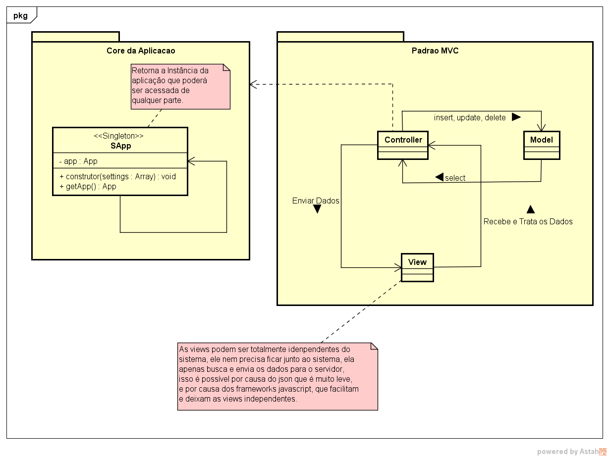

<p align="center">
  
</p>

# Trabalho de Engenharia de Software 2

<p align="justify">
O trabalho basicamente tem duas partes, primeiro foi criado um framework para tentar abordar não só 1 ou 2, mas vários conceitos conceitos de padrões de projetos abordados dentro de sala,
segue logo abaixo o framework que foi feito como base para o desenvolvimento do trabalho:
</p>

- [Lua Framework](https://github.com/lucaslz/lua)

<p align="justify">
A decisão de criar um framework para o desenvolvimento do sistema partiu apartir da necessidade de tirar o maior proveito possível da disciplina de engenharia de software, pois fazer o trabalho em código puro não é viável e iria demorar muito, e também não seria viável usar um framework, pois não daria para usar alguns conceitos aprendidos dentro de sala.
</p>

[](public/assets/video/screencast-eentry.com-2018.07.11-19-09-14.webm "Audi R8")
## Como foi desenvolvido o trabalho ?

<p align="justify">
Talvez não sejá possível criar o sistema completo, pelo fato da data da entrega do trabalho, mas creio que aproveitamos muito tudo o que foi aprendido na matéria, e a documentão do sistema está muito bem definida e não terá problemas de ter o entendimento do trabalho. conseguimos abordar vários conceitos de padrões de projeto de criação, estrutural e comportamental, e também trabalhamos com o conceito de componentes e fizemos alguns testes unitários, segue logo abaixo alguns conceitos usados:
</p>


- Componentes
- Padrão MVC
- Parão Singleton: Usando o conseito de gerenciamento de depencenia para usar serviços em todo o sistema em tempo de execução.
- Composite: Para isso usando o conceito de trait no PHP
- Bridge: As traits ajudam nesse ponto além de o conceito de pacotes que ajudam a criar funcionalidades isolada evitando o acoplamento no sistema.
- Decorator: Mais uma vez as traits ajudam nesse conceito, pois ao usar traits é possível reutiliza-las em várias partes no sistema funciona como um tipo de herança multipla.
- PHPUnit: também foi usado os testes unitário para testar as funcionalidades básicas do sistema.

## Modelagem do sistema

<p align="justify">
Diagrama de classes do sistema, como não foi possível entregar o sistema completo ao olhar os arquivos criado nas pastas do MVC, verá que estara faltando algumas coisa:
</p>

<p align="center">
  
</p>

<p align="justify">
Diagrama de padrões de projetos utilizado no sistema, lembrando que não foi só esses os padrões utilizados no sistema, mas foram os propostos enquanto o trabalho ainda estava em faze de desenvolvimento.
</p>

<p align="center">
  
</p>

<p align="justify">
Esse é o diagrama ER do sistema é o diagrama oficial e é o ultilizado no sistema, lembrando que o script de criação do banco de daos esta junto com o código no GitHub, na pasta "Arquivos fontes do Tralho".
</p>

<p align="center">
  
</p>

## Testes

Para rodar os teste no sistema use o  PHPUnit dentro da pasta de projeto na linha de comando:

```bash
$ phpunit
```

## Creditos

- [Lucas Lima](https://github.com/lucaslz)
- Samuell Magalhães
- Leonardo Barcelos Nardy
- Isabela Cristina Oliveira
-  Ângelo Thasmo Bitencourt 
